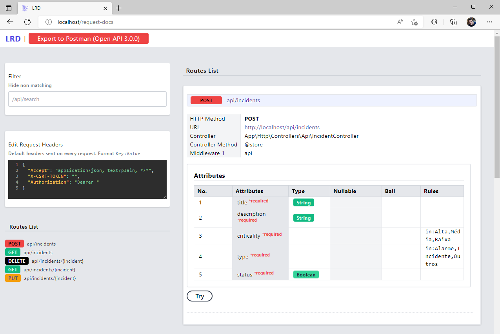
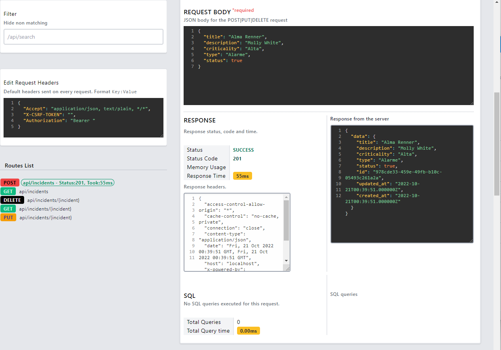

<h1 align="center">
    Cadastro de Incidents API
</h1>

## 🛥️ Sobre o projeto
Esse sistema é uma demonstração simples de uma API backend para servir a um CRUD de Incidentes (incidents). 

## 🏗️ Tecnologias:
- **[PHP 8.1](https://www.php.net)**
- **[Laravel](https://laravel.com/)**
- **[MySQL](https://www.mysql.com/)**
- **[Laravel Request Docs](https://github.com/rakutentech/laravel-request-docs)**
- **[PHPUnit](https://phpunit.de)**

## 🚀 Como rodar esse projeto
Primeiramente, clone este projeto aonde você costuma desenvolver seus projetos:
```
git clone git@github.com:lucassouzati/crud-incidentes-api.git
```
Caso esteja no Windows e não tenha ambiente de desenvolvimento, recomendo que utilize WSL (Windows Subsystem for Linux) junto com Ubuntu, Docker e Laravel Sail. 
Em seguida, vá para pasta e execute:
```
composer install
```
Caso veja algum erro nesse comando, execute o seguinte comando para instalar as dependências do Sail:
```
docker run --rm \
    -u "$(id -u):$(id -g)" \
    -v $(pwd):/var/www/html \
    -w /var/www/html \
    laravelsail/php81-composer:latest \
    composer install --ignore-platform-reqs
```
Em seguida, crie o .env do projeto
```
cp .env.example .env
```
E agora para instalar o Sail com MySQL, execute o comando:
```
php artisan sail:install --with=mysql
```
E agora para rodar o Sail do Laravel, execute o comando
```
./vendor/bin/sail up -d
```
Configure um alias no seu .bashrc ou equivalente para não precisar especificar o diretório do sail em todos comandos
```
alias sail='[ -f sail ] && sh sail || sh vendor/bin/sail'
```
Agora só rodar as migrations e comandos pelo Sail
```
sail artisan migrate
```
Para rodar os testes automatizados:
```
sail artisan test
```
## 📖 Documentação da API

Em meus projetos backend, costumo utilizar o Laravel Request Docs que documenta automaticamente os endpoints da API, baseados em design patterns do Laravel. Voê pode acessar pela caminho:
```
http://localhost/request-docs
```
Nessa mesma página você pode realizar chamaadas aos endpoins, e verificar os parâmetros e suas validações.
<h4 align="center">
    
    
</h4>
## 🤔 Como contribuir para o projeto

- Faça um **fork** do projeto;
- Crie uma nova branch com as suas alterações: `git checkout -b my-feature`
- Salve as alterações e crie uma mensagem de commit contando o que você fez:`git commit -m "feature: My new feature"`
- Envie as suas alterações: `git push origin my-feature`

> Caso tenha alguma dúvida confira este [guia de como contribuir no GitHub](https://github.com/firstcontributions/first-contributions)

## 📝 Licença

Este projeto esta sobe a licença MIT. Veja a [LICENÇA](https://opensource.org/licenses/MIT) para saber mais.

Feito com ❤️ por Lucas Siqueira 👋🏽 [Entre em contato!](https://www.linkedin.com/in/lucas-de-souza-siqueira-a6469952/)
